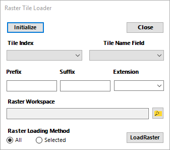

# ArcMapRaster Tile Loader

### Used to add raster file to ArcMap based upon a tile index.

There are time when a mosaic dataset is either overkill or actually will  
distort the data you are looking at so it is much more efficient to pull in  
each raster tile. This can be a long process so this tool helps make this  
process much faster by linking a tile index to a workspace (directory)  
containing the raster files and pulls them in based upon said tile index.

